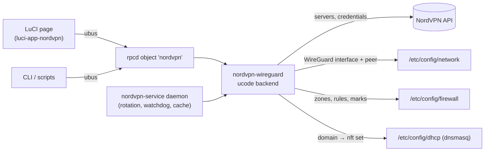

# NordVPN for OpenWrt — LuCI Extras

Manage NordVPN on your OpenWrt router from the LuCI web interface: sign in
once, pick where you want to appear, and decide which devices, networks or
websites go through the VPN. The router keeps the tunnel healthy by itself.


> **Unofficial.** This project is not affiliated with, endorsed by, or supported
> by Nord Security. "NordVPN" and "NordLynx" are trademarks of their respective
> owners. You need your own NordVPN subscription and access token.

## What it's for

NordVPN's own apps run on phones and computers, one device at a time. Running
the VPN **on the router** covers everything behind it: smart TVs, consoles,
IoT gadgets and guests, none of which need an app. Doing that by hand on
OpenWrt means generating WireGuard configs, finding working servers, writing
policy-routing rules and firewall zones, and fixing things when a server dies.

This project does all of that from one LuCI page:

- **Easy setup.** Paste a NordVPN access token, choose countries, press
  *Save and reconnect*. There are no config files to edit and no keys to copy
  around.
- **Choose what goes through the VPN.** Send the whole LAN, only some
  networks, only some devices, or only some websites.
- **It maintains itself.** It verifies servers before using them, rotates
  them on a schedule, and replaces a dead tunnel automatically.
- **Power-user features.** Several VPN tunnels at once, each in a different
  country, with Double VPN, Onion over VPN, a kill switch and IPv6 leak
  protection.
- **No LuCI required.** The backend works from the command line and over
  ubus too, so scripts and headless routers can use it.

This is a fork of [**Aladex/nordvpn-luci**](https://github.com/Aladex/nordvpn-luci)
that adds the extra features marked **(fork)** below.

## Features

### Connecting

- **One-time sign-in.** Your NordVPN token is exchanged for a WireGuard key
  once and is **never stored**. The browser never sees the token or the key.

  

- **Location sets.** Pick whole countries or specific cities. The first
  connection and every rotation choose from this set.

  

- **Server picker.** It's grouped by country and sorted by load, with a
  one-click *Lowest load*, or you can leave it on *Automatic*. Pinning a
  server locks the tunnel to it.

  

- **Hop modes.** *Single hop*, *Multihop* (Double VPN: enter in one country
  and exit in another), or *Onion over VPN* (exit through Tor). Tor servers
  are never picked unless you choose that mode.

  

- **Load-aware server choice (fork).** Automatic connects and rotations
  prefer lightly loaded servers but still spread out, so several routers or
  tunnels don't all land on the same one. You can also choose *Lowest load
  first* or plain *Random*.
- **P2P servers only (fork).** Limit a tunnel to NordVPN's servers optimised
  for file sharing. Dedicated IP servers are never picked automatically, but
  they're tagged in the picker so you can pin your own.

### Staying connected

- **Handshake-verified servers.** NordVPN's list includes dead endpoints, so
  every candidate server must complete a real WireGuard handshake before it
  is used. If none do, the last working server is restored.
- **Scheduled rotation.** Rotate every N minutes or at a set time of day. The
  page shows when the next rotation will happen.

  

- **Watchdog.** It automatically switches servers when a tunnel goes stale,
  with backoff so a bad day doesn't hammer the servers.
- **Internet check.** It pings through the tunnel to catch a server that
  answers handshakes but forwards no traffic.
- **Live status.** The page shows the real connected city, the public IP seen
  through the tunnel, uptime, traffic and throughput, and the recent events
  (connects, rotations, recoveries) for each tunnel.

### Choosing what goes through the VPN

- **Whole LAN.** A firewall zone and default route through the tunnel. The
  WAN default route is never modified.
- **Steered networks.** Only selected networks (for example a *media* or
  *guest* VLAN) use the tunnel. Local subnets stay reachable.

  

- **Steered devices.** Pick single devices from a searchable list of known
  clients. They're matched by MAC address, so they stay on the VPN after a
  new DHCP lease.
- **Steered domains (fork).** Send only traffic to chosen websites (and
  their subdomains) through the VPN, for example one streaming service,
  while everything else uses your normal connection.
- **Kill switch and IPv6 leak block.** When the tunnel is down, steered
  traffic is blocked rather than leaking out through the WAN.
- **NordVPN DNS.** Optionally use NordVPN's resolvers, or Threat Protection,
  which blocks ads and malware at the DNS level.
- **Leaves your own setup alone.** If you already route traffic by hand, the
  app detects it and doesn't touch it. Everything it creates is tagged and
  removed cleanly.

  

### Several tunnels at once

- **Multiple instances.** Run tunnels side by side, for example the main
  LAN through Germany and a media network through Serbia. Each has its own
  credentials, locations, schedule and routing.

  

- **Advanced settings.** MTU (with a recommendation calculated from your WAN),
  connection timeout, server attempts, cache location and more.

  

## How it works



The project ships as **two packages**:

- **`nordvpn-wireguard`**, the backend (ucode, procd and an rpcd/ubus
  object). It handles credentials, the server-list cache, WireGuard setup,
  verification, rotation, routing and status. It works without LuCI.
- **`luci-app-nordvpn`**, the web page. It's a thin JavaScript view that only
  calls the backend over ubus and does nothing privileged itself.

## Installation

Supported: **OpenWrt snapshots** and **OpenWrt 25.12** (both use `apk`).

### Prebuilt packages from this fork

Every CI run builds architecture-independent `.apk` packages. Download the
`nordvpn-packages` artifact from a run on the
[Actions page](https://github.com/I-press-buttons/nordvpn-luci-extras/actions),
or from [Releases](https://github.com/I-press-buttons/nordvpn-luci-extras/releases)
once a tagged version is published. Then, on the router:

```sh
apk add --allow-untrusted ./nordvpn-wireguard-*.apk ./luci-app-nordvpn-*.apk
```

Log out of LuCI and back in, then open **VPN → NordVPN**. Installing only
`nordvpn-wireguard` gives you a headless CLI/ubus service.

> The signed package feed at `aladex.github.io/nordvpn-luci` belongs to the
> original project and serves the **upstream** packages, without this fork's
> additions.

### Build from source

Build with the OpenWrt SDK for your target:

```bash
# backend (packages feed style)
cp -r nordvpn-wireguard "$SDK/package/nordvpn-wireguard"
cd "$SDK" && ./scripts/feeds update -a && ./scripts/feeds install -a
make defconfig
make package/nordvpn-wireguard/compile

# frontend (from an openwrt/luci checkout)
cp -r luci-app-nordvpn openwrt-luci/applications/luci-app-nordvpn
# build via the luci feed as usual
```

### Optional: domain steering

Steered domains need a dnsmasq that can fill nftables sets. Replace the
stock one with the full build. Download it first, because removing dnsmasq
also stops the router's own DNS:

```sh
cd /tmp && apk update && apk fetch dnsmasq-full
apk del dnsmasq && apk add ./dnsmasq-full-*.apk
```

## Quick start

1. Open LuCI → **VPN → NordVPN**.
2. Click **Set credentials** and paste your 64-character access token. To get
   one, go to
   <https://my.nordaccount.com/dashboard/nordvpn/manual-configuration/> →
   **Generate new token** (a non-expiring token is fine).
3. Choose a **Hop mode** and add one or more **Locations**.
4. Leave **Server** on *Automatic*, or pin a specific server.
5. Optionally turn on **Automatic rotation** and choose what to route under
   **Traffic routing**.
6. Click **Save and reconnect**.

The page shows *configured* and *connected* as separate states: it only
reports *Connected* once a real WireGuard handshake has happened.

## Reference

<details>
<summary><b>Configuration file (<code>/etc/config/nordvpn</code>)</b></summary>

The backend owns the non-secret settings. A fresh install ships **disabled**.
There's one `config instance` section per tunnel. `main` is the default
instance and also holds the shared cache options.

```
config instance 'main'
	option enabled '0'
	option interface 'nordvpn'
	option routing_table ''
	option mtu ''                     # empty = default 1420; UI recommends WAN-80
	option hop_mode 'single'          # 'multihop' (Double VPN) / 'onion' (via Tor)
	option server_group ''            # '' = any, 'p2p' = P2P servers only (single hop)
	option country_code 'ee'         # legacy single-country fallback, used only
	option city_code 'ee-tallinn'    #   when 'locations' below is empty
	list locations 'ee'              # location set: countries and/or 'cc-city',
	list locations 'nl-amsterdam'    #   drives both the connect and the rotation
	option fixed_server ''            # pin a gateway; disables rotation and watchdog
	option rotation_enabled '0'
	option rotation_mode 'interval'  # or 'time'
	option rotation_interval '360'   # minutes
	option rotation_time '04:30'     # HH:MM, router local time
	option verify_timeout '8'        # seconds to wait for a WG handshake
	option max_retries '10'          # candidate servers per rotation
	option selection 'balanced'      # server order: balanced | least_load | random
	option watchdog '0'              # auto-reconnect a stale tunnel (off when pinned)
	option egress_probe '0'          # ping through the tunnel every 30 s (internet check)
	list probe_target '1.1.1.1'      # IPv4 probe targets; default 1.1.1.1 + 8.8.8.8
	option auto_routing '1'          # route all LAN traffic via the VPN
	list source_network 'media'      # or: steer only these networks
	list source_device 'aa:bb:cc:dd:ee:ff'  # and/or individual devices, by MAC
	list steer_domain 'example.com'  # and/or domains (+ subdomains); needs dnsmasq-full
	option killswitch '0'            # block steered traffic while VPN is down
	option block_ipv6 '1'            # block direct IPv6 (leak prevention)
	option vpn_dns 'off'             # off | standard | threat (NordVPN resolvers)
	option cache_dir ''              # empty = /tmp, shared by all instances; /etc, /usr, /root etc. are refused
	option cache_refresh_interval '21600'   # seconds, background refresh
```

The generated WireGuard interface and peer live in `/etc/config/network` and
are owned by the backend. The private key is stored there for netifd, but it
never appears in any status or ubus response.

**MTU** stays at netifd's WireGuard default (1420) unless you set it. The page
recommends `WAN MTU − 80` (for example 1412 on a 1492 PPPoE line) and offers
a one-click **Use recommended**. Lower it if pages hang or throughput is
poor. LTE/5G uplinks often need less. TCP MSS clamping stays on as a
backstop.

</details>

<details>
<summary><b>ubus API</b></summary>

All methods are on the `nordvpn` object. Read methods never change anything,
and secrets are never returned.

```bash
ubus call nordvpn status            # runtime state, location, handshake age
ubus call nordvpn instances         # status of every configured VPN instance
ubus call nordvpn external_ip       # public IP as seen through the tunnel
ubus call nordvpn history '{"instance":"main"}'  # recent events, newest first
ubus call nordvpn disconnect        # take the tunnel down, pause rotation
ubus call nordvpn clear_credentials # forget the stored WireGuard key
ubus call nordvpn locations         # cached country/city tree (+ per-city counts)
ubus call nordvpn servers '{"locations":["de","nl-amsterdam"],"hop_mode":"single","server_group":"p2p"}'
ubus call nordvpn refresh_status    # cache-refresh job progress
ubus call nordvpn set_credentials '{"token":"<64-hex-token>"}'
ubus call nordvpn apply             # rebuild the peer and bring the tunnel up
ubus call nordvpn rotate_now        # one-shot rotation
ubus call nordvpn refresh_locations # start an async server-list refresh
```

`status`, `apply`, `rotate_now` and `set_credentials` accept an `instance`
argument (default `main`). `create_instance` and `delete_instance` manage
instances, and `nordvpn-rotate <name>` rotates one instance from the CLI.

`status` reports these states:

- `connected` means a WireGuard handshake happened in the last 3 minutes.
- `degraded` means the interface is up but the handshake went stale.
- `no_egress` means the handshake is fresh but nothing gets through (only
  reported with the internet check on).

It also reports `enabled`, `fixed` (a server is pinned), `rotation.next_run`,
and, while the tunnel is up, `uptime` and `transfer`.

Access is gated by the `luci-app-nordvpn` ACL. A read-only LuCI account can't
call the write methods.

</details>

<details>
<summary><b>Server verification, rotation and selection</b></summary>

All WireGuard servers in a country share one public key, so a dead endpoint
still brings the interface "up" without an error. Both **apply** and
**rotation** therefore wait up to `verify_timeout` seconds for a real
handshake (`wg show latest-handshakes`) before accepting a server.

- **Rotation always changes server.** The current server is excluded. Up to
  `max_retries` candidates are tried, and if none completes a handshake the
  last working server is restored. If nothing but the current server
  matches, rotation leaves the working tunnel alone.
- **Try order** comes from `option selection`:
  - `balanced` (the default) is a shuffle weighted by `101 − load`.
  - `least_load` tries servers strictly by load.
  - `random` ignores load.

  Load figures come from the cached server list, so they're at most
  `cache_refresh_interval` (6 h by default) old.
- **Rotation stays within the hop mode.** Multihop rotates among Double VPN
  servers with the same exit country. Onion rotates among onion servers
  only. With `server_group 'p2p'`, single hop rotates among P2P servers only.
  The smaller pools may have only one server in a location, and then there
  is nothing to rotate to.
- **Scheduling.** The rotation clock is saved in
  `/tmp/nordvpn_rotate_state.json`, so a daemon restart neither resets the
  schedule nor triggers an extra rotation.

</details>

<details>
<summary><b>Watchdog and internet check</b></summary>

- **Watchdog** (`option watchdog '1'`) is off by default. If a tunnel stays
  `connecting`, `degraded` or `disconnected` for 60 s, the watchdog rotates
  to another verified server. Retries back off from 120 s, doubling up to
  900 s, and the backoff resets once the tunnel reconnects. It never runs
  while a server is pinned, and it shares a lock with scheduled rotation.
- **Internet check** (`option egress_probe '1'`) pings the probe targets
  through the tunnel device every 30 s. It uses IPv4 literals, so no DNS is
  needed. After 3 failures in a row the state becomes `no_egress`, and the
  watchdog, if it's on, treats that like a stale handshake. The failure count
  starts over whenever the server changes.

</details>

<details>
<summary><b>Traffic routing and firewall details</b></summary>

On every apply the backend first works out which routing mode applies:

- **Manual.** Your own routes or rules reference the VPN interface or its
  table. The app then doesn't touch routing or the firewall. It only warns
  if IPv6 could leak.
- **Automatic** (*Route all LAN traffic*). The backend sets
  `route_allowed_ips` on the peer, creates a masquerading zone and a
  LAN → VPN forwarding, and adds optional REJECT rules for the kill switch
  and IPv6, plus the DNS override.
- **Steered.** Policy rules send only the selected traffic into the
  instance's routing table:
  - **Networks:** `in <network> lookup <table>` at priority 20000.
  - **Devices:** an fw4 MARK rule per MAC, and one `mark … lookup <table>`
    rule at priority 19000. The mark is the table id in the top byte
    (`0xff000000`), which keeps clear of mwan3 and pbr, so the table id must
    be 1–255. The default table gets one automatically.
  - **Domains:**
    - dnsmasq resolves the listed domains into an fw4 nft set
      (`nv_<interface>_dom`), using a tagged `config ipset` in
      `/etc/config/dhcp`.
    - One MARK rule gives LAN traffic to those addresses the device mark.
    - This needs `dnsmasq-full`; without it nothing is created and the page
      warns. It's IPv4 only, at most 64 domains per instance, and only works
      for clients that use the router's DNS (DNS-over-HTTPS bypasses it).
    - A firewall reload empties the set. The backend restarts dnsmasq after
      its own changes; otherwise the set refills as clients look the names up
      again.

  Prohibit rules (priority 21000) act as the kill switch and IPv6 block.
  They only fire when the tunnel's table can't serve the traffic. Every local
  IPv4 subnet is mirrored into the table so LAN and VLAN traffic stays local.

Everything the app creates is tagged `nordvpn_managed`. Turning a toggle off
removes exactly those objects. User zones, forwardings, routes, rules and
dnsmasq sections are never modified.

</details>

<details>
<summary><b>Services, logs and cache</b></summary>

```bash
service nordvpn status
service nordvpn version        # installed version
logread -e nordvpn
```

One procd-supervised daemon (`nordvpn-service`) re-reads the config every
30 s. It refreshes the server list every `cache_refresh_interval`, and also
on its first tick if the cache is older than 24 h or was written by an older
version. **Refresh server list** in the UI runs the same worker on demand.
Cache writes are atomic and locked, and a failed refresh keeps the previous
cache.

The last 50 events per instance are kept in `/tmp/nordvpn_events*.json` and
are cleared on reboot.

</details>

## Security

- The access token reaches curl only through an anonymous pipe. It never
  appears in argv, environment variables, temp files or logs, and it's never
  saved.
- External commands are built from argument lists, and every interpolated
  value (interfaces, hostnames, domains, schedules, paths) is validated
  against an allow-list first.
- Every ubus input has a fixed schema and is validated for format and range.
- The browser never receives the token or the WireGuard private key.

## Upgrading

Upgrading from the legacy Lua `luci-app-nordvpn` runs a one-time migration.
It copies your settings, keeps the existing key and tunnel, and removes any
stored token and old cron jobs. Downgrading to the Lua package isn't
supported.

## Related projects

- [**Aladex/nordvpn-luci**](https://github.com/Aladex/nordvpn-luci) is the
  original project this fork is based on, and it has its own signed package
  feed at <https://aladex.github.io/nordvpn-luci/>.
- [**NordVPN Lite**](https://nordvpn.com/blog/nordvpn-for-openwrt-routers/) is
  the official, deliberately minimal OpenWrt client: one NordLynx connection
  with a basic setup.
- [**NordVPN-Easy-OpenWrt**](https://github.com/tis24dev/NordVPN-Easy-OpenWrt)
  is a shell-based community integration with health checks and recovery.
- Config generators such as
  [NordVPN-WireGuard-Config-Generator](https://github.com/mustafachyi/NordVPN-WireGuard-Config-Generator)
  produce static `.conf` files and leave routing, rotation and recovery to
  you.

## Development

The offline ucode tests need no account and no network:

```bash
# with ucode + ucode-mod-fs + ucode-mod-math available
sh nordvpn-wireguard/tests/run.sh
```

CI (`.github/workflows/build.yml`) runs shell and JSON checks, ESLint on the
LuCI view, the ucode tests, and a snapshot-SDK build of both packages.

## Credits and license

Originally created by **Andrey Aleksandrov** ([@Aladex](https://github.com/Aladex))
as [nordvpn-luci](https://github.com/Aladex/nordvpn-luci). This fork adds
load-aware selection, the P2P server filter and domain steering on top.

[MIT](LICENSE). Do whatever you want with it, just keep the copyright notice.
